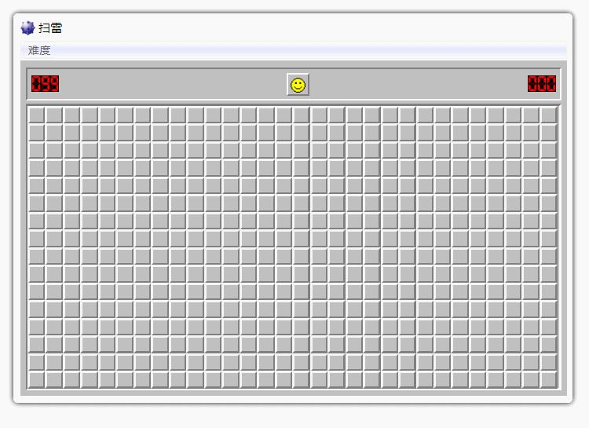

# 扫雷

扫雷是一款经典的游戏，本项目使用`TypeScript`开发，配合一些设计模式，尽可能让项目变的结构清晰利于拓展。

扫雷游戏体验网址： [https://huyaocode.github.io/mineClearance/](https://huyaocode.github.io/mineClearance/)

项目实现的功能有：

 - 基础的扫雷功能
 - 难度选择
 - 排行榜




用到设计模式有以下几个：
 - 观察者（发布-订阅）模式
   - 实现事件的发布与接收
  
 - 单例模式
   - 保证仅有一个事件中心

 - 建造者模式
   - 搭了个架子，利于拓展

 - 状态模式
   - 右键点击格子时，旗子，问号，空白的切换 

 - 装饰器模式
   - 写日志

 - 工厂模式
   - 生成一些类


此外，还在选择不同难度处用到了反射技术，即根据字符串来生成一个类。


## 设计模式应用

### 发布-订阅模式
不同于简单的观察者模式，在此项目中很多对象即需要订阅事件，又需要发布事件。所以我剥离出了一个事件中心，让这个事件中心来转发事件。

每一个组件都可以去listen某个事件，也可以 trigger某个事件。项目中广泛的使用了这种方法，让类与类之间解耦，真的是非常好用！


应用场景：
 - 雷的爆炸
   - 当一个雷被引爆时会通知所有雷爆炸。

 - 游戏胜利
   - 当所有的雷被找到后，提示用户游戏胜利的实例对象会收到通知

 - 计时器开始计时
   - 当用户在雷区上点击后，计时器开始计时。
	
 - 旗子数量的增减
   - 当用户使用右键点击后，旗子数量减少
   - 当不使用旗子时，旗子数量增加

事件中心实现与使用方式：
事件中心代码位于： [src/util/EventCenter.ts](src/util/EventCenter.ts)

使用时获取到EventCenter实例，trigger 或 listen 都可以。

   

### 单例模式

既然上文中提到了事件中心，那么事件中心肯定就只能有一个啊，不然不同的对象之间都没法互通消息了，而将事件中心中记录事件映射关系的map做成静态的其实也可以，但是如果每个地方要用事件了都去 new 一个事件中心是耗费内存的。

使用一个单例模式来让事件中心仅可被获取到一份是一个好的选择。

以下是JavaScript使用闭包生成单例的代码：
```js
// 返回单例
let getSingleEventCenter = (function() {
  let eventCenter
  return function() {
    if (!eventCenter) {
      eventCenter = new EventCenter()
    }
    return eventCenter
  }
})()
```

### 建造者模式

建造者模式适用于：组成项目的组件基本不变，但项目复杂、各部分改如何组合到一起经常变换。

扫雷项目中雷区的行列数量经常变换。虽然这个只要配置一个参数就可以了，但是可以用建造者模式中导演类来决定雷区的行列数、雷的概率。并指导“扫雷”的页面应该如何将各组件组合到一起。

扫雷有**简单、普通、困难**3种模式，现在还不够复杂，所以我把3个build合成了一个了，只有导演类有还保留有3个。

目录结构：
```
src
├── Buider
│   └── Build.ts
├── director
│   ├── Director.ts
│   ├── DirectorEasy.ts
│   ├── DirectorGeneral.ts
│   ├── DirectorHard.ts
│   └── IMineAreaConfig.ts
├── ClassFactory
│   ├── classMap.ts
│   └── index.ts
├── MineClear.ts
├── components
│   ├── Block.ts
│   ├── DOM.ts
│   ├── DifficultyPicker.ts
│   ├── Face.ts
│   ├── FlagCounter.ts
│   ├── GameWin.ts
│   ├── MineArea.ts
│   ├── RackList.ts
│   └── Timer.ts
├── config.ts
├── index.ts
└── util
    ├── EventCenter.ts
    ├── StateMachine.ts
    ├── getCurentTime.ts
    ├── getNumberHTMLStr.ts
    ├── log.ts
    └── stopPropagation.js
```

### 状态模式
扫雷中右键点击格子可以标记，标记一共有3个状态。


原来的代码就是一段连续的if - else来判断当前状态是什么。但让代码耦合性很强，读起来很难受。 所以我实现了一个工具函数 [StateMachine](src/util/StateMachine.ts) 来管理状态的切换。

使用起来比较方便
```js
// 创建实例
this.rightClickState = new StateMachine('blank', {
  blank: {
    nextState: 'flag',
    handler: () => {
      this.dom.innerHTML = ``
    }
  },
  flag: {
    nextState: 'doubt',
    handler: () => {
      this.dom.innerHTML = ``
      if (this.isBomb) {
        eventCenter.trigger('correct_find')
      }
      eventCenter.trigger('flag_use', this.x, this.y)
    }
  },
  doubt: {
    nextState: 'blank',
    handler: () => {
      this.dom.innerHTML = ``
      if (this.isBomb) {
        eventCenter.trigger('error_find')
      }
      eventCenter.trigger('flag_unuse')
    }
  }
})
```
```js
// 右键点击时切换状态， 只需要调用 next() 方法就好
this.dom.oncontextmenu = e => {
  stopBubble(e)
  if (!this.hasClicked) {
    this.rightClickState.next()
  }
  return false
}
```

### 反射

在JS里第一次写反射，之前没见人这么在前端里写过，但用起来真香！

实现方式：
在[classMap.ts](src/ClassFactory/classMap.ts) 中引入想反射的类，并且导出这个类到一个default对象中
```js
import DirectorEasy from '../director/DirectorEasy'
import DirectorGeneral from '../director/DirectorGeneral'
import DirectorHard from '../director/DirectorHard'

export default {
  DirectorEasy,
  DirectorGeneral,
  DirectorHard
}
```

在  [ClassFactory/index.ts](src/ClassFactory/index.ts) 中获取上面的 classMap， 并导出一个创建类的工厂函数
```js
import classMap from './classMap'

function classFactory  (className: string) {
  if (className in classMap) {
    return new classMap[className]()
  } else {
    throw TypeError('no this class: ' + className)
  }
}

export default classFactory
```

用的时候就很方便了， 比如我在难度选择的地方是这样用的


## 项目中的一些待改进的地方

### 数据中心
没有一个数据中心，我把一些少量的数据存在window对象上，这是不够好的。虽然可以用 ESModule模块化（本质上是闭包）来实现，但个人觉得数据中心得有个数据中心的样子。

### 事件名应该为常量
为了避免程序员编码时的错误，并且让所有的事件名有一个汇总，有一个事件中心是最好不过的。大概像下面这样

```js
// EventNames.ts

export const GAME_WIN = 'game_win'
export const MINE_EXPLODE = 'mine_explode'
```

```js
// 使用者

import { GAME_WIN, MINE_EXPLODE } from 'EventNames.ts'

eventCenter.tigger(GAME_WIN, 'some args')
eventCenter.listen(MINE_EXPLODE, ()=> {
  // do someting
})
```
